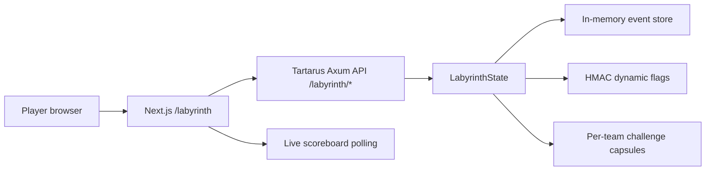

# Labyrinth Architecture

Labyrinth is the CTF layer hosted inside Tartarus. It uses the existing Axum gateway and Next.js app rather than standing up a separate service, so a local Tartarus deployment can run the sandbox, Escape Arena, and CTF from one checkout.

## Runtime Shape



## Server Module

Path: `crates/tartarus-server/src/labyrinth.rs`

The server owns the authoritative CTF state:

- Six seeded LeoOS challenges mapped to the kill-chain.
- Team creation with unique invite code.
- Sequential gating via `unlock_after`.
- Dynamic per-team flags: `flag{challenge_slug_hmac}`.
- Decay scoring with floor points.
- First blood detection and solve-time tiebreaking.
- Hint unlocks with point cost.
- Submission rate limiting and shared-flag fingerprinting.
- Per-team instance records with Tartarus-style connection URIs.
- Challenge action endpoints that model each vulnerable service.
- Scoreboard, recent solves, and JSON export.

The current store is intentionally in-memory so the whole portfolio can be launched without external services. The API shapes match the distributed model from the spec and can be moved behind Postgres/Redis later without changing the web client.

## Web Module

Paths:

- `web/src/lib/labyrinth.ts`
- `web/src/app/labyrinth/page.tsx`

The web route provides the real player workflow on first load:

- Join event and persist team id in `localStorage`.
- View unlocked/locked challenge board.
- Launch per-team challenge instance.
- Run challenge-specific workbench actions.
- Inspect returned artifacts and submit dynamic flags.
- Buy hints, see writeups after solve, and watch live scoreboard state.
- Export event state as JSON for admin/demo review.

## API

All endpoints are mounted under `/labyrinth` on the Tartarus gateway.

| Method | Path | Purpose |
| --- | --- | --- |
| `GET` | `/labyrinth/event` | Public event metadata, challenge summary, scoreboard |
| `POST` | `/labyrinth/teams` | Create a team |
| `GET` | `/labyrinth/teams/:team_id/board` | Team-scoped board, hints, writeups, instances |
| `POST` | `/labyrinth/teams/:team_id/submissions` | Submit a flag |
| `POST` | `/labyrinth/teams/:team_id/challenges/:slug/actions` | Exercise a challenge workbench |
| `POST` | `/labyrinth/teams/:team_id/challenges/:slug/instance` | Allocate/refresh a per-team instance record |
| `POST` | `/labyrinth/teams/:team_id/challenges/:slug/hints/:order` | Unlock a hint |
| `GET` | `/labyrinth/scoreboard` | Scoreboard and recent solves |
| `GET` | `/labyrinth/export` | Admin JSON export |

## Security Notes

- Flags are generated server-side with HMAC-SHA256 and never stored.
- A submitted flag that belongs to another team is rejected and fingerprinted as `shared_flag`.
- Wrong submissions are capped per team in a rolling 60-second window.
- Challenge action responses reveal flags only after the required exploit conditions are met.
- Challenge instances are represented as scoped Tartarus capsules. A future containerized backend should bind these records to actual isolated workloads.
- `LABYRINTH_FLAG_SECRET` must be set for hosted events. The local fallback is for development only.
- `LABYRINTH_ADMIN_TOKEN` can be set for hosted events; when present, `/labyrinth/export` requires `x-labyrinth-admin-token`.

## Local Run

Terminal 1:

```powershell
& "C:\Users\leots\.cargo\bin\cargo.exe" run -p tartarus-server -- all --bind 127.0.0.1:8080
```

Terminal 2:

```powershell
cd web
$env:NEXT_PUBLIC_TARTARUS_API="http://127.0.0.1:8080"
npm run dev
```

Open `http://localhost:3000/labyrinth`.

## Verification

Backend:

```powershell
& "C:\Users\leots\.cargo\bin\cargo.exe" test -p tartarus-server labyrinth
```

Frontend:

```powershell
cd web
npm run lint
npm run build
```

End-to-end:

1. Run the Tartarus API and Next.js dev server.
2. Create a team on `/labyrinth`.
3. Launch `Parser Poltergeist`.
4. Run the default avatar exploit.
5. Submit the returned dynamic flag.
6. Confirm score increases and `Prompt & Circumstance` unlocks.
